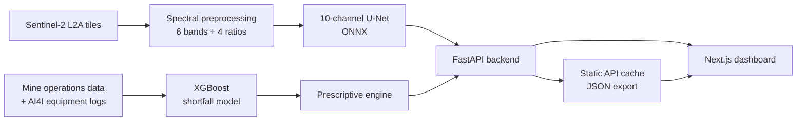

# Manganese Reserve Identification and Mine Production Shortfall Prevention

AI/ML and space technology for MOIL Limited. Submitted to Smart India Hackathon 2026.

**Repository:** https://github.com/Ppratik765/Manganese-ore-detection-and-prediction

---

## Overview

MOIL Limited is India's largest producer of manganese ore. Keeping the national supply chain steady means solving two problems at the same time:

1. **Reserve identification.** Conventional geological exploration is slow and expensive. Spaceborne optical and short-wave infrared (SWIR) imagery can reveal hydrothermal alteration haloes, gossan caps and manganese host lithologies across large terrains.
2. **Production shortfall prevention.** Output is repeatedly disrupted by monsoon rainfall, loss of haul-road traction, variable blast fragmentation and mechanical fatigue in heavy equipment.

This project combines both into a single command center. A 10-channel U-Net converts Sentinel-2 L2A imagery into calibrated manganese prospectivity maps, an XGBoost model forecasts shift-level production shortfall, and a prescriptive engine turns each forecast into concrete mitigation actions with quantified tonnage recovery.

## Key capabilities

| Capability | Description |
| :--- | :--- |
| Spaceborne anomaly delineation | A 10-channel U-Net fuses six surface-reflectance bands with four diagnostic band ratios to produce Mn prospectivity maps and ranked drill-hole targets. |
| Shortfall forecasting | An XGBoost model predicts shift tonnage and shortfall probability from weather, pit water, road friction, fragmentation, blast delay and fleet state. |
| Prescriptive dispatch | Instead of only reporting a risk, the optimizer proposes pumping, dumper rerouting, secondary breaking and blending actions, each with expected recovery and an urgency window. |
| What-if simulation | Operators can stress-test a shift (monsoon surge, blast choking, shovel failure) and see the forecast and mitigation plan update immediately. |
| Fleet health scoring | Equipment telemetry (torque, speed, thermal load, wear, strain) is scored for failure risk using the AI4I dataset. |
| Serverless deployment | The dashboard runs on Vercel with no Python backend by serving pre-computed inference from a static cache. |

## System architecture



The frontend talks to the FastAPI backend when one is available and otherwise falls back to the static cache, so the same build works locally, against a live model server, and on Vercel.

## Dashboard

The Mission Control interface is a Next.js 14 application.

- **Geospatial prospectivity map.** Leaflet map with a smoothly interpolated prospectivity raster, drill-hole targets, lease boundary, a dark and a satellite basemap, and a live cursor readout of prospectivity.
- **Metric cards.** Shift extraction, spaceborne Mn grade with model confidence, fleet readiness and shortfall risk index.
- **Production analytics.** Seven-day actual versus target tonnage with the AI forecast and the gap between them.
- **Prescriptive dispatch.** Mitigation actions on a timeline, each with a live intervention-window countdown.
- **Fleet telemetry.** Per-machine failure-risk gauges, temperature and load, with status filtering.
- **Simulation sheet.** Preset scenarios and continuous controls for rainfall, pit water, blasting and fleet parameters.
- **Ambient motion.** An animated topographic background and count-up transitions. Motion follows the operating system's reduced-motion setting and can be paused from the navigation bar; the choice is remembered.

Fonts are bundled with the application and no external font service is contacted. Basemap tiles come from OpenStreetMap (dark view, darkened with a CSS filter) and Esri World Imagery (satellite). Both are keyless, so no API key or account is needed, but they do require network access.

## Getting started

### Run the dashboard (demo mode)

No Python environment is required. The dashboard reads pre-computed results from `frontend/public/vercel_static_api_cache.json`.

```bash
cd frontend
npm install
NEXT_PUBLIC_USE_STATIC_CACHE=true npm run dev
```

Open http://localhost:3000. On Windows PowerShell, set the variable first with `$env:NEXT_PUBLIC_USE_STATIC_CACHE="true"`.

### Run with the live backend

```bash
pip install -r requirements.txt
python backend/run_backend.py --port 8000
```

In a second terminal run `npm run dev` inside `frontend/`. Requests to `/api/*` are proxied to `http://127.0.0.1:8000`. Set `NEXT_PUBLIC_API_URL` to point the client at a different server.

### Regenerate the static cache

After retraining the models, with the backend running:

```bash
python data/scripts/export_static_api.py
```

Commit the updated `frontend/public/vercel_static_api_cache.json`.

### Deploy to Vercel

1. Push the repository to GitHub.
2. Import it in Vercel and set the project root directory to `frontend`.
3. The Next.js framework preset is detected automatically. Deploy.

## Repository layout

```
backend/                      FastAPI service (routes, inference and optimizer services)
data/
  scripts/                    Satellite fetch, spectral preprocessing, synthetic operations, API export
  processed/                  Spectral patches, dataset split, mine operations table
frontend/                     Next.js 14 dashboard
manual_data/                  AI4I 2020 predictive maintenance dataset
ml_pipelines/
  reserve_segmentation/       U-Net model, dataset, training and ONNX export
  production_forecasting/     XGBoost training and prescriptive engine
scripts/                      Environment setup and training helpers
```

## Backend API

| Method | Endpoint | Purpose |
| :--- | :--- | :--- |
| GET | `/api/reserves/sectors` | List registered mining belts |
| GET | `/api/reserves/grid?sector=<id>` | Probability grid, drill-hole targets and reserve estimates for a sector |
| GET | `/api/operations/telemetry?sector=<id>` | Shift status, equipment fleet and seven-day production history |
| POST | `/api/operations/simulate` | Run a what-if scenario and return forecast plus prescriptive plan |
| GET | `/api/health` | Service health |

Interactive documentation is served at `/docs` when the backend is running.

## Sector coverage

The system monitors 20 manganese mining belts across Madhya Pradesh, Maharashtra, Odisha, Goa, Karnataka, Gujarat, Jharkhand, Rajasthan and Andhra Pradesh. Representative entries:

| Sector ID | Belt and key mine | State | Mine type | Primary mineralogy | Avg. grade | Est. reserves |
| :--- | :--- | :--- | :--- | :--- | :---: | :---: |
| `balaghat_bharweli` | Balaghat Belt (Bharweli Mine) | Madhya Pradesh | Underground and open cast | Braunite / Pyrolusite | 44.5% Mn | 14.2 MT |
| `bhandara_dongri_buzurg` | Bhandara Belt (Dongri Buzurg Mine) | Maharashtra | Open cast | Psilomelane / Pyrolusite | 41.2% Mn | 9.8 MT |
| `odisha_keonjhar_joda` | Keonjhar Belt (Barbil, Joda and Thakurani) | Odisha | Open cast | Cryptomelane / Pyrolusite | 43.5% Mn | 16.8 MT |

The full list is defined in `frontend/src/lib/api.ts` and served by `/api/reserves/sectors`.

## Methodology

### Spectral input tensor

Each satellite patch becomes a 10-channel tensor of shape (10, 256, 256): six surface-reflectance bands and four diagnostic ratios.

| Index | Formula | Purpose |
| :--- | :--- | :--- |
| NDVI | `(B08 - B04) / (B08 + B04)` | Separates rock exposure from vegetation |
| Clay / alteration | `B11 / B12` | Highlights Al-OH phyllosilicates and hydrothermal schists |
| Ferrous minerals | `B12 / B08` | Delineates pyrolusite, braunite and jacobsite lithologies |
| Iron oxide | `B04 / B02` | Identifies gossans, limonite and hematite caps |

### Ground-truth anomaly score

Training labels are derived from a weighted combination of the normalized indices:

```
Anomaly_Score = 0.35 * Ferrous_norm + 0.30 * IronOxide_norm + 0.25 * Clay_norm - 0.30 * NDVI_norm
```

### Production forecasting and mitigation

The XGBoost model estimates shift tonnage and the probability of a shortfall. The prescriptive engine then evaluates the operating conditions against thresholds (rainfall and pit water, fragmentation and blast delay, fleet availability and haul cycle) and emits ranked actions with expected recovery in tonnes and the time window in which they remain effective.

## Technology

| Layer | Stack |
| :--- | :--- |
| Frontend | Next.js 14, React 18, TypeScript, Tailwind CSS, Framer Motion, Recharts, Leaflet |
| Backend | FastAPI, Uvicorn, ONNX Runtime |
| Modeling | PyTorch (U-Net), XGBoost, scikit-learn |
| Geospatial | Sentinel-2 L2A via STAC, Rasterio, Shapely, GeoPandas |
| Deployment | Vercel (static cache mode) |

## Team

Priyanshu Pratik and team, developed for MOIL Limited as part of Smart India Hackathon 2026.
